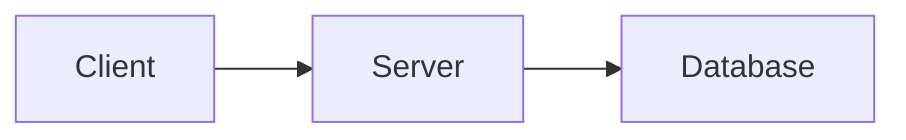

# Client Server Architechtiure and REST

- Notes by [Milind](https://milind.bio.link/)

- Github Repo: [Backend Notes](https://github.com/thatbeautifuldream/backend-notes)

## Client Server Architecture

- Its a mental model of how a networked application works.
- Whenever there is any communication between two systems in a network, there are things that are common everywhere, one system is called a client and the other system is called a server.
- `Client` - any end system (mobile phone, browser, process, python program ...) that initiates a request from a server is considered as a Client. Here end system is a system which is not a server. So a mobile phone is a end system, a browser is a end system, a process is a end system, a python program is a end system. So any system which is not a server is a end system or a client.

> Client is lets say a end system which is requesting for a service from a server, example zomato mobile app requesting for a list of restaurants from zomato server. Server is a system which is providing a service to a client, example zomato server providing a list of restaurants to zomato mobile app. Now the server inorder to process the request may talk to a database and provide the response to the client. Now a database is a system which stores data and provides a service to the server. So the client is requesting for a service from the server, server is requesting for a service from the database and the database is providing a service to the server and the server is providing a service to the client.

- Any end system that can recieve request process it and spits out a response is a server. So a database is a server, a python program is a server, a process is a server, a browser can be a server, a mobile phone can be a server. So any end system which is providing a service to a client is a server.
- `Server` - any system that provides a service to a client is considered as a Server. Here a system which is providing a service to a client is a server. So a database is a server, a python program is a server, a process is a server, a browser is a server, a mobile phone is a server. So any system which is providing a service to a client is a server.

- `R.E.S.T.` is a architectural style for designing networked applications. More commonly it is used to describe the way web services communicate over HTTP.
- `R.E.S.T.` stands for `Representational State Transfer`, which does not self explain that much, but it is a architectural style for designing networked applications.
