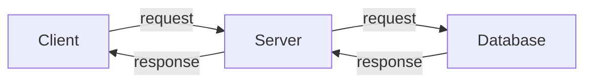
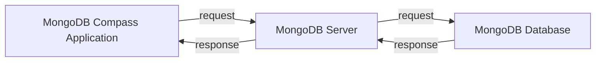

# Client Server Architechtiure and REST

- [Milind's notes taken from the **Backend in Node.js from Scratch** course by Sanket Singh](https://github.com/thatbeautifuldream/backend-notes)

[](https://github.com/singhsanket143)

## Client Server Architecture

- Its a mental model of how a networked application works.
- Whenever there is any communication between two systems in a network, there are things that are common everywhere, one system is called a client and the other system is called a server.
- `Client` - any end system (mobile phone, browser, process, python program ...) that initiates a request from a server is considered as a Client. Here end system is a system which is not a server. So a mobile phone is a end system, a browser is a end system, a process is a end system, a python program is a end system. So any system which is not a server is a end system or a client.

> Client is lets say a end system which is requesting for a service from a server, example zomato mobile app requesting for a list of restaurants from zomato server. Server is a system which is providing a service to a client, example zomato server providing a list of restaurants to zomato mobile app. Now the server inorder to process the request may talk to a database and provide the response to the client. Now a database is a system which stores data and provides a service to the server. So the client is requesting for a service from the server, server is requesting for a service from the database and the database is providing a service to the server and the server is providing a service to the client.

- Any end system that can recieve request process it and spits out a response is a server. So a database is a server, a python program is a server, a process is a server, a browser can be a server, a mobile phone can be a server. So any end system which is providing a service to a client is a server.
- `Server` - any system that provides a service to a client is considered as a Server. Here a system which is providing a service to a client is a server. So a database is a server, a python program is a server, a process is a server, a browser is a server, a mobile phone is a server. So any system which is providing a service to a client is a server.
- Simmilarly with `databases` just installing database application on system wont do the job, you need to boot up the database server inorder to provide a service to the program requesting for data.



- For example lets take MongoDB, we have the application MongoDB Compass Application (just a GUI for you to interact with the db) which we can boot up and connect to the respective database server and then we can perform CRUD operations on the database. So the MongoDB Compass Application is a client, the MongoDB database server is a server and the MongoDB database is a database.



- Generally the mongodb server uri looks like `mongodb://localhost:27017` , here mongodb is the protocol, localhost is the loopback host (127.0.0.1), 27017 is the port.
- Now you may create a python program which can connect to the mongodb server and perform CRUD operations on the database. This illustrates a point that client can be anything irrespective of them having a GUI or not. Here the python program is a client, the mongodb server is a server and the mongodb database is a database.
- Client can be anything that requests for service, its a general programming term.
- Now talking about Servers, Even a mongodb application will not work untill unless you boot up the database server. Now this process can be running in the system background and you may not even know about it. It remains on until the system is on and whenever you make a query to the database it will process all queries and spit out the response accordingly to the client.

> Now this communication may happen over any medium, lets say it can happen over HTTP (Application layer protocol) or HTTPS that depends over TCP (Transport Layer Protocol) or UDP or any other protocol. So the client and server can communicate over any protocol. `Detailed Explanation` : The TCP may involve the three way handshake and then the client and server may communicate over HTTP or HTTPS or any other protocol.

- Whenever this type of communication happens there are some rules that needs to be followed, some conventions that needs to be followed.

## API (Application Programming Interface)

> 🌶️ HOT-TAKE : If you work in an organisation and daily if you dont say this word "API" to 5-10 people, I'm not sure you actually work in an organisation.

- API stands for `Application Programming Interface`.
- Most important amongst them being `Interface`, it stands like a contract of application programming.
- This contract is defined in the API.
- Browser has `setTimeout`, `getElementById` ... these are all APIs. So these are all interfaces that the browser provides to the client. Hence the name Browser APIs.
- We may only know what input it takes what output it returns and what processing it does on the input we provide. So in the contract its defined that if you provide this input you will get this output and this is the processing that will be done on the input.
- API is a set of rules that needs to be followed by the client and server in order to communicate with each other. They are plain old functions just much more broader in sense.
- There can be other type of APIs than these browser APIs, like [CoWin API](https://apisetu.gov.in) which is an API provided by the government of india for the users to get the data related to covid.

> Fun fact: The CoWin api throws a `403 Forbidden` in Taiwan, seems like the api is region restricted. These type of restrictions are called `Geo Restrictions`.

- Now this API serves for a purpose and is not implemented inside a library function call but instead it is available over the internet and can be accessed over a network call. So the client can make a request to the server and get the response. Hence its a `Web API`.
- The working being that user may make a request over HTTP and may get a response accrdingly. Now the respose will only be served if the request satisfies the API contract. So the request must be in the format that the API expects it to be and the response will be in the format that the API expects it to be. Also the permitted resourse must be requested by the client, if the client requests for a resource that is not permitted by the API then the API will not serve the response. Likely all this information is to be available in the API documentation.

- [Fake Store API](https://fakestoreapi.com) is a web api that provides data related to products, users, carts, orders, categories, etc. This is a public api and anyone can use it. This api is not region restricted and can be accessed from anywhere in the world.

```js
fetch("https://fakestoreapi.com/products")
  .then((res) => res.json())
  .then((data) => console.log(data));
```

- The above code snippet is a client side code that makes a request to the fake store api and gets the response. The response is in the form of a json object. The response is an array of objects where each object represent a product. The response is an array of 20 objects. The response is an array of 20 objects where each object represent a product. Each product object has the following properties `id`, `title`, `price`, `description`, `category`, `image`. So this is the response that the fake store api serves for the request made by the client.

- Getting 5 products from the fake store api. The limit query parameter is used to limit the number of products that are returned in the response.

```js
fetch("https://fakestoreapi.com/products?limit=5")
  .then((res) => res.json())
  .then((json) => console.log(json));
```

- Response

```json
[
  {
    "id": 1,
    "title": "Fjallraven - Foldsack No. 1 Backpack, Fits 15 Laptops",
    "price": 109.95,
    "description": "Your perfect pack for everyday use and walks in the forest. Stash your laptop (up to 15 inches) in the padded sleeve, your everyday",
    "category": "men's clothing",
    "image": "https://fakestoreapi.com/img/81fPKd-2AYL._AC_SL1500_.jpg",
    "rating": {
      "rate": 3.9,
      "count": 120
    }
  },
  {
    "id": 2,
    "title": "Mens Casual Premium Slim Fit T-Shirts ",
    "price": 22.3,
    "description": "Slim-fitting style, contrast raglan long sleeve, three-button henley placket, light weight & soft fabric for breathable and comfortable wearing. And Solid stitched shirts with round neck made for durability and a great fit for casual fashion wear and diehard baseball fans. The Henley style round neckline includes a three-button placket.",
    "category": "men's clothing",
    "image": "https://fakestoreapi.com/img/71-3HjGNDUL._AC_SY879._SX._UX._SY._UY_.jpg",
    "rating": {
      "rate": 4.1,
      "count": 259
    }
  },
  {
    "id": 3,
    "title": "Mens Cotton Jacket",
    "price": 55.99,
    "description": "great outerwear jackets for Spring/Autumn/Winter, suitable for many occasions, such as working, hiking, camping, mountain/rock climbing, cycling, traveling or other outdoors. Good gift choice for you or your family member. A warm hearted love to Father, husband or son in this thanksgiving or Christmas Day.",
    "category": "men's clothing",
    "image": "https://fakestoreapi.com/img/71li-ujtlUL._AC_UX679_.jpg",
    "rating": {
      "rate": 4.7,
      "count": 500
    }
  },
  {
    "id": 4,
    "title": "Mens Casual Slim Fit",
    "price": 15.99,
    "description": "The color could be slightly different between on the screen and in practice. / Please note that body builds vary by person, therefore, detailed size information should be reviewed below on the product description.",
    "category": "men's clothing",
    "image": "https://fakestoreapi.com/img/71YXzeOuslL._AC_UY879_.jpg",
    "rating": {
      "rate": 2.1,
      "count": 430
    }
  },
  {
    "id": 5,
    "title": "John Hardy Women's Legends Naga Gold & Silver Dragon Station Chain Bracelet",
    "price": 695,
    "description": "From our Legends Collection, the Naga was inspired by the mythical water dragon that protects the ocean's pearl. Wear facing inward to be bestowed with love and abundance, or outward for protection.",
    "category": "jewelery",
    "image": "https://fakestoreapi.com/img/71pWzhdJNwL._AC_UL640_QL65_ML3_.jpg",
    "rating": {
      "rate": 4.6,
      "count": 400
    }
  }
]
```

- The API Documentation may describe the particular input format, it may describe that what exactly you require to pass in params or the header or the body of the request to get a valid response. And also the kind of output you can expect from the `endpoint`. Endpoint being the technical term for the url that you are making the request to.

- `R.E.S.T.` is a architectural style for designing networked applications. More commonly it is used to describe the way web services communicate over HTTP.
- `R.E.S.T.` stands for `Representational State Transfer`, which does not self explain that much, but it is a architectural style for designing networked applications.
