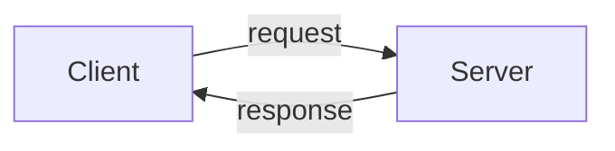
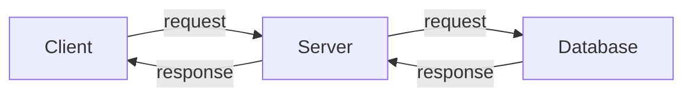
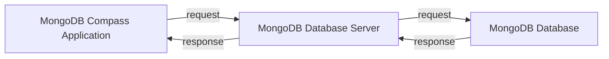

# Client Server Architechtiure and REST

- Notes by [Milind](https://milind.bio.link/)

- Github Repo: [Backend Notes](https://github.com/thatbeautifuldream/backend-notes)

## Client Server Architecture

- Its a mental model of how a networked application works.
- Whenever there is any communication between two systems in a network, there are things that are common everywhere, one system is called a client and the other system is called a server.
- `Client` - any end system (mobile phone, browser, process, python program ...) that initiates a request from a server is considered as a Client. Here end system is a system which is not a server. So a mobile phone is a end system, a browser is a end system, a process is a end system, a python program is a end system. So any system which is not a server is a end system or a client.

> Client is lets say a end system which is requesting for a service from a server, example zomato mobile app requesting for a list of restaurants from zomato server. Server is a system which is providing a service to a client, example zomato server providing a list of restaurants to zomato mobile app. Now the server inorder to process the request may talk to a database and provide the response to the client. Now a database is a system which stores data and provides a service to the server. So the client is requesting for a service from the server, server is requesting for a service from the database and the database is providing a service to the server and the server is providing a service to the client.

- Any end system that can recieve request process it and spits out a response is a server. So a database is a server, a python program is a server, a process is a server, a browser can be a server, a mobile phone can be a server. So any end system which is providing a service to a client is a server.
- `Server` - any system that provides a service to a client is considered as a Server. Here a system which is providing a service to a client is a server. So a database is a server, a python program is a server, a process is a server, a browser is a server, a mobile phone is a server. So any system which is providing a service to a client is a server.

- Simmilarly with `databases` just installing database application on system wont do the job, you need to boot up the database server inorder to provide a service to the program requesting for data.

- For example lets take MongoDB, we have the application MongoDB Compass Application (just a GUI for you to interact with the db) which we can boot up and connect to the respective database server and then we can perform CRUD operations on the database. So the MongoDB Compass Application is a client, the MongoDB database server is a server and the MongoDB database is a database.

- Generally the mongodb server uri looks like `mongodb://localhost:27017` , here mongodb is the protocol, localhost is the loopback host (127.0.0.1), 27017 is the port.
- Now you may create a python program which can connect to the mongodb server and perform CRUD operations on the database. This illustrates a point that client can be anything irrespective of them having a GUI or not. Here the python program is a client, the mongodb server is a server and the mongodb database is a database.
- Client can be anything that requests for service, its a general programming term.
- Now talking about Servers, Even a mongodb application will not work untill unless you boot up the database server. Now this process can be running in the system background and you may not even know about it. It remains on until the system is on and whenever you make a query to the database it will process all queries and spit out the response accordingly to the client.

> Now this communication may happen over any medium, lets say it can happen over HTTP (Application layer protocol) or HTTPS that depends over TCP (Transport Layer Protocol) or UDP or any other protocol. So the client and server can communicate over any protocol. `Detailed Explanation` : The TCP may involve the three way handshake and then the client and server may communicate over HTTP or HTTPS or any other protocol.

- `R.E.S.T.` is a architectural style for designing networked applications. More commonly it is used to describe the way web services communicate over HTTP.
- `R.E.S.T.` stands for `Representational State Transfer`, which does not self explain that much, but it is a architectural style for designing networked applications.
