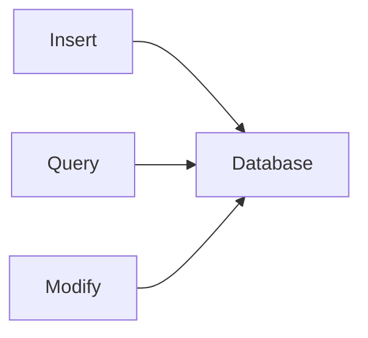

# Basics of DB

- We can store data in diffrent ways. Example Sheets, Files, Database, etc.
- Simmilar to traditional ways of storing data, we can store data in DB.
- For usecase lets say we're building a twitter application, so in order to store tweets we can use DB.
- And the mechanism to retrive data from DB is called as **Querying**.
- We can use DB to store data in a structured way.

> The Data base provides us an interface that helps us insert data, query data and modify data.

- There are a lot of databases available in the market, but we'll be using **MongoDB**.
- There are Relational DBs and Non-Relational DBs.
- Relational DBs are the ones which store data in a tabular format and relation exists between tables.
- Example: MySQL, Oracle, PGSQL, etc.
- Non-Relational DBs are the ones which store data in a non-tabular (nono-relational) format.
- MongoDB is a Non-Relational DB.
- **NoSQL** here you can do all the db related operations without using SQL queries.
- **NoSQL** is a general term used for Non-Relational DBs but stands for **Not Only SQL**.
- In these NoSQL Databases the data gets stored in graph based format, key-value pairs like Redis, document based like MongoDB, etc.
